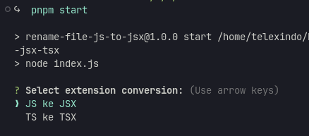

# Rename File JS/TS to JSX/TSX


## WHY ?

"Why did I create it? Because I once faced a migration case from CRA to Vite, and it would be troublesome if I had to rename each file one by one. Therefore, I made this, and perhaps it could be useful.😅"

## Description

This Node.js script provides a convenient way to rename JavaScript (`.js`) or TypeScript (`.ts`) files to JSX (`.jsx`) or TSX (`.tsx`) within the `src` directory or its subdirectories. It's useful for projects transitioning from plain JavaScript or TypeScript to JSX or TSX files, commonly used in React applications.

## Installation

Before running the script, ensure you have [Node.js](https://nodejs.org/) installed on your machine. Then, install the project dependencies using npm, pnpm, or yarn:

```
npm install
```

## Usage

To initiate the renaming process, run the following command:

```
npm start
```

You will be presented with a prompt to choose the conversion type:

- JavaScript to JSX
- TypeScript to TSX

Once selected, the script will recursively scan the `src` directory and its subdirectories for JavaScript or TypeScript files and rename them accordingly to JSX or TSX.

## License

This project is licensed under the ISC License. See the [LICENSE](LICENSE) file for details.

## Author

- [rizal suryawan](https://github.com/zalwan)

---

Dengan README yang diperbarui ini, pengguna akan mendapatkan pemahaman yang lebih baik tentang kemampuan skrip dan cara penggunaannya. Jika ada yang perlu disesuaikan lagi, jangan ragu untuk memberi tahu saya!
